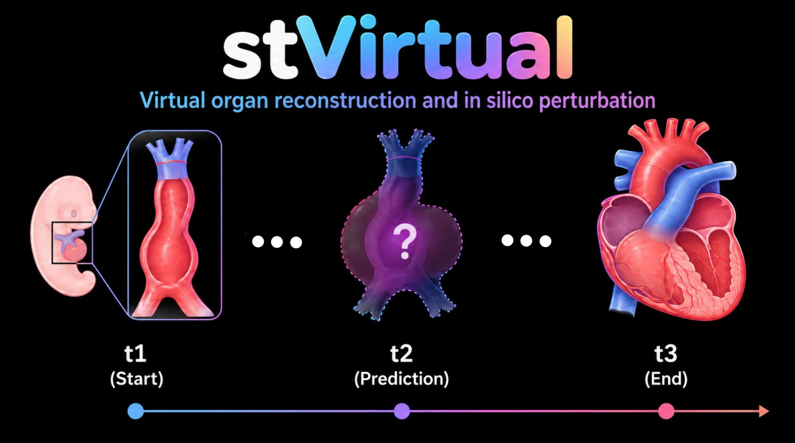

# stVirtual

<p align="center">
  
</p>

stVirtual is a niche-driven multi-agent generative framework for reconstructing spatiotemporal 3D and 4D tissue dynamics from sparse and static measurements across space, time, and disease progression.

## Installation

The code was tested on a workstation equipped with a 208-core Intel(R) Xeon(R) Platinum 8473C CPU, 512 GB of RAM, and an NVIDIA RTX PRO 6000 GPU with 96 GB of RAM, running Ubuntu 24.04.3 LTS and Python 3.12.11. If possible, stVirtual should be run with CUDA acceleration.

### Install stVirtual in the virtual environment by conda
* First, install conda: https://docs.anaconda.com/anaconda/install/index.html
* Then, create an envs named stVirtual with python 3.12.11

```bash
cd stVirtual
conda create -n stVirtual python=3.12.11 -y
conda activate stVirtual
pip install -r requirements.txt
```
**Note:** If CUDA-related PyTorch or PyG packages fail to install, install PyTorch and PyG separately using wheels that match your CUDA version, then rerun `pip install -r requirements.txt` for the remaining dependencies. KeOps is required for efficient large-scale kernel and OT computations; installation instructions are available in the official KeOps documentation: https://www.kernel-operations.io/keops/index.html

### Typical installation time:

- Existing CUDA/PyTorch-compatible environment: 5-15 minutes
- Fresh Linux workstation with package downloads: 20-60 minutes
- CPU-only desktop: 15-45 minutes, but full training is not recommended

## Tutorials

* [Virtual slices generation for 3D reconstruction](https://github.com/YjZhou16/stVirtual/wiki/Tutorial2%EF%BC%9AMouse_brain-demo): 3D tissue reconstruction using spatial transcriptomics data (Stereo-seq data) in mouse brain

* [4D tumor reconstruction and in silico pertubation](https://github.com/YjZhou16/stVirtual/wiki/Tutorial1%EF%BC%9AGP1-demo): 4D tissue reconstruction using paired normal and tumor sections in human gastric cancer


## Reference
Zhou Y., ..., Chen L.#, Zuo, C.#, Reconstructing tissue dynamics and enabling in silico perturbation from spatial omics through niche-driven multi-agent learning, 2026, Under review.

