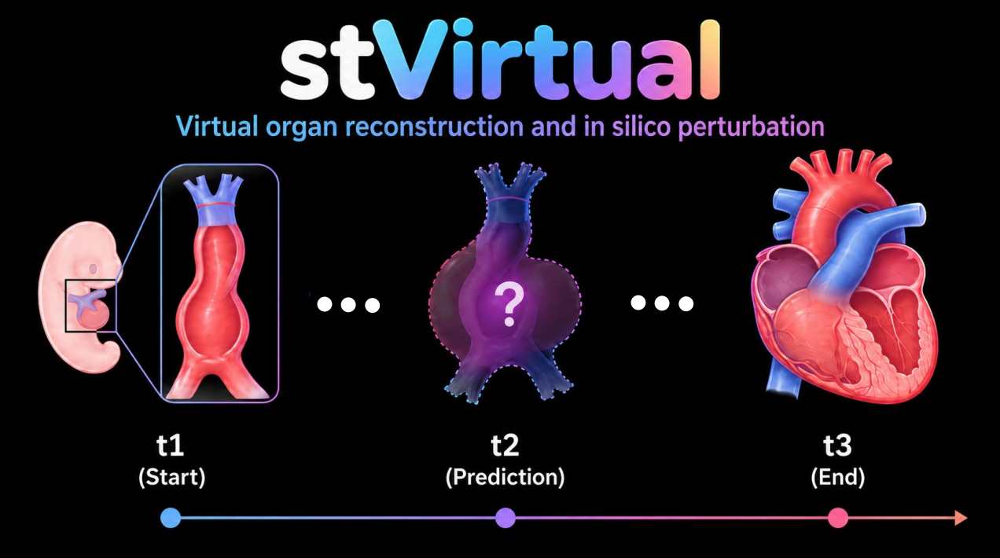

# stVirtual

<p align="center">
  
</p>

stVirtual is a niche-driven multi-agent generative framework for reconstructing spatiotemporal 3D and 4D tissue dynamics from sparse and static measurements across space, time, and disease progression.

## Installation

The code was tested on a workstation equipped with a 208-core Intel(R) Xeon(R) Platinum 8473C CPU, 512 GB of RAM, and an NVIDIA RTX PRO 6000 GPU with 96 GB of RAM, running Ubuntu 24.04.3 LTS and Python 3.12.11. If possible, stVirtual should be run with CUDA acceleration.

### Pre-release binary distribution

During manuscript review, the core implementations in `stvirtual.models` are
distributed as a compiled binary wheel rather than as Python source files. This
temporary distribution protects the unpublished model implementation while still
allowing users and reviewers to install, train, evaluate, and run every public
workflow in this repository. The complete model source code is planned for release
with the publication version.

The small Python files under `src/stvirtual/models/` are compatibility wrappers.
They forward calls to the compiled `stvirtual-core` package, so the public API and
all notebook imports remain unchanged. For example:

```python
from stvirtual.models import stage1_2d
from stvirtual.models import stage2_2d_lineage
```

The bundled wheel currently supports CPython 3.12 on Linux x86_64. It does not
support Python 3.10/3.11, macOS, Windows, ARM64, or PyPy. Unsupported platforms
fail explicitly during installation; there is no silent fallback to a different
model implementation. A compiled wheel raises the barrier to casual source
inspection but should not be interpreted as absolute protection against reverse
engineering.

### Install stVirtual in the virtual environment by conda
* First, install conda: https://docs.anaconda.com/anaconda/install/index.html
* Then, create an envs named stVirtual with python 3.12.11

```bash
cd stVirtual
conda create -n stvirtual python=3.12.11 -y
conda activate stvirtual
pip install -r requirements.txt
python -c "from stvirtual.models import stage1_2d, stage2_2d; print('stVirtual models ready')"
```

`requirements.txt` installs the bundled `stvirtual-core` wheel before installing
the public package in editable mode. Verify the wheel checksum against
`wheels/SHA256SUMS` when copying it outside this repository.

**Note:** If CUDA-related PyTorch packages fail to install, install PyTorch separately using a wheel that matches your CUDA version, then rerun `pip install -r requirements.txt` for the remaining dependencies.

### Typical installation time:

- Existing CUDA/PyTorch-compatible environment: 5-15 minutes
- Fresh Linux workstation with package downloads: 20-60 minutes
- CPU-only desktop: 15-45 minutes, but full training is not recommended

## Data availability

Source datasets are not redistributed. Download links, accessions, access restrictions, and the expected local layout are listed in [Data Availability](docs/Data-Availability.md).

## Tutorials

- [TissueFlow 2D Tutorial](docs/wiki/01-tissueflow-2d.md) — Mbrain, Membryo, and OpenST.
- [LineageFlow 2D Tutorial](docs/wiki/02-lineageflow-2d.md) — GP1 and LUAD.
- [VolumeFlow 3D Tutorial](docs/wiki/03-volumeflow-3d.md) — add a non-lineage volumetric dataset.
- [CardioLineage 3D Tutorial](docs/wiki/04-cardio-lineage-3d.md) — corrected Mcardiac lineage workflow.

Each tutorial documents input data, preprocessing, decoder training, Stage 1, boundary generation, Stage 2, rollout outputs, and the recommended execution order.
