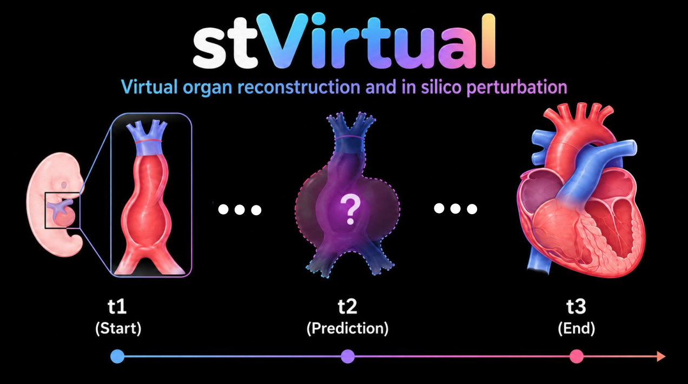

# stVirtual

[](https://doi.org/10.5281/zenodo.23192164)

stVirtual, a niche-informed multi-agent generative framework for reconstructing intermediate tissue states in 3D and 4D and inferring population-level transitions from sparse measurements across space, time, and disease stages.




## Installation

The code was tested on a workstation equipped with a 208-core Intel(R) Xeon(R) Platinum 8473C CPU, 512 GB of RAM, and an NVIDIA RTX PRO 6000 GPU with 96 GB of RAM, running Ubuntu 24.04.3 LTS and Python 3.12.11. If possible, stVirtual should be run with CUDA acceleration.

For the Mbrain example, we recommend **at least 64 GB system RAM and 24 GB GPU memory**. See [Quick start](https://github.com/YjZhou16/stVirtual/wiki/Quick-start).

### Model runtime

The model runtime is distributed as a precompiled wheel for CPython 3.12 on Linux x86_64.

### Install with conda

Install [conda](https://docs.anaconda.com/anaconda/install/index.html), then create the stVirtual environment:

```bash
git clone https://github.com/YjZhou16/stVirtual.git
cd stVirtual
conda create -n stvirtual python=3.12.11 -y
conda activate stvirtual
pip install -r requirements.txt
source env/activate.sh
python -c "from stvirtual.models import stage1_3d, stage2_3d; print('stVirtual models ready')"
```

`requirements.txt` installs the bundled `stvirtual-core` wheel before installing
the public package in editable mode. The wheel checksum is listed in `wheels/SHA256SUMS`.

For CUDA, install a PyTorch build that matches your CUDA version, then install the remaining dependencies with `pip install -r requirements.txt`.

### Typical installation time:

- Existing CUDA/PyTorch-compatible environment: 5-15 minutes
- Fresh Linux workstation with package downloads: 20-60 minutes
- CPU desktop: 15-45 minutes

## Start with an example

Follow the [Quick start](https://github.com/YjZhou16/stVirtual/wiki/Quick-start) to quickly get started with stVirtual.

## Data availability

Data sources, required files, and local folders are listed in the **Input data** section of each [Wiki workflow](https://github.com/YjZhou16/stVirtual/wiki) below.

## Tutorials

[Notebook tutorials on Read the Docs](https://stVirtual-tutorial.readthedocs.io/en/latest/) cover preprocessing, training, results, and perturbation experiments.

- [Quick start](https://github.com/YjZhou16/stVirtual/wiki/Quick-start) — Mbrain.
- [3D tissue reconstruction](https://github.com/YjZhou16/stVirtual/wiki/3D-tissue-reconstruction) — HMLN, Mbrain, and Human breast cancer.
- [Developmental reconstruction across time](https://github.com/YjZhou16/stVirtual/wiki/Developmental-reconstruction-across-time) — Membryo and Mcardiac_EA.
- [Cancer progression across stages](https://github.com/YjZhou16/stVirtual/wiki/Cancer-progression-across-stages) — Human gastric cancer and Human lung cancer.
- [4D spatiotemporal development reconstruction](https://github.com/YjZhou16/stVirtual/wiki/4D-spatiotemporal-development-reconstruction) — Mcardiac.

- [Perturbation](https://github.com/YjZhou16/stVirtual/wiki/Perturbation) — Human gastric cancer, Human lung cancer, Mcardiac, and Mcardiac_EA.

## Citation

Yijin Zhou, ..., Luonan Chen*, Chunman Zuo*. Reconstructing tissue-state transitions and enabling in silico perturbation from spatial omics through niche-informed multi-agent learning. Under review (2026).
