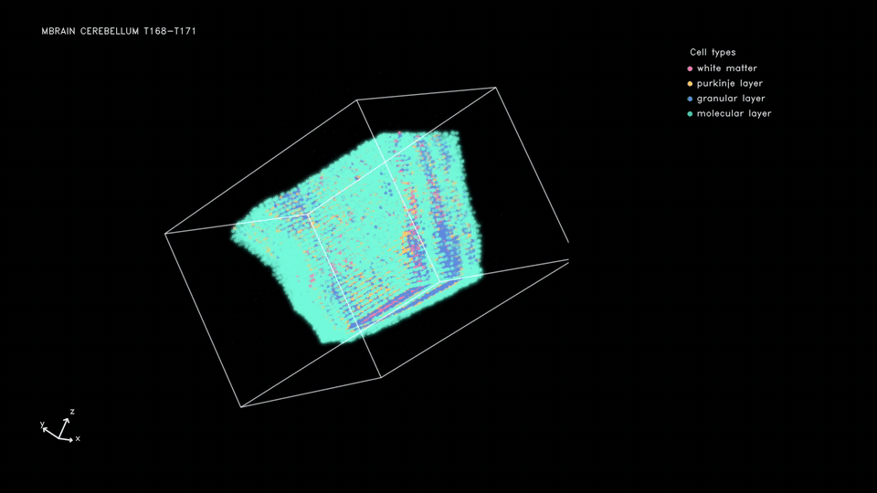
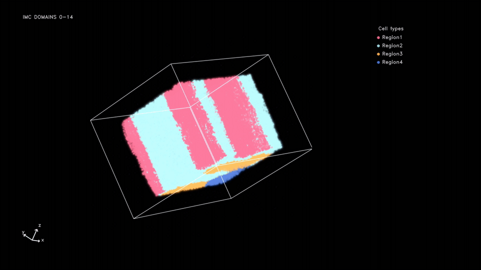

# 3D tissue reconstruction

This tutorial covers 3D tissue reconstruction for **HMLN**, **Mbrain**, and **Human breast cancer**. The RNA workflows below use scanVI and an expression decoder; the [Human breast cancer protein workflow](#human-breast-cancer-protein-workflow) uses measured protein features directly. Run commands from the repository root:

```bash
conda activate stvirtual
source env/activate.sh
```

## Results

### Mbrain — T168 to T171



### HMLN — three slice windows

The GIF concatenates the S1–S3, S4–S6, and S7–S9 slice windows in that order. The displayed windows correspond to upstream S2–S4, S17–S19, and S24–S26, respectively.


The upstream slice correspondence is documented in [HMLN](../../experiments/HMLN/README.md#upstream-slice-correspondence). For measured protein inputs, see the [Human breast cancer protein workflow](#human-breast-cancer-protein-workflow).

### Human breast cancer — slices 0 to 14



## 1. Choose an RNA experiment

```text
experiments/Mbrain/
experiments/HMLN/
```

Each directory contains `config.yaml`, `preprocess.ipynb`, `decoder.ipynb`, and `train.ipynb`. Mbrain uses the mouse LR table; HMLN uses the human table. The configured models are `stvirtual.models.stage1_3d` and `stvirtual.models.stage2_3d`.

## 2. Input data

Place or symlink the source data under `experiments/<dataset>/data/`. The preprocessing notebook produces categorical stage and cell-type annotations, spatial coordinates, a raw `counts` layer, and a registered AnnData suitable for scanVI. The recommended latent key is `obsm["X_scanVI"]`; use `latent_key` in `config.yaml` to select another `obsm` representation.

## 3. Preprocessing

Open `experiments/<dataset>/preprocess.ipynb`. It harmonizes labels and coordinates, trains scanVI, and saves the model-ready data to:

```text
experiments/<dataset>/artifacts/checkpoints/scanvi/adata.h5ad
```

Mbrain preprocessing also performs alignment and LR computation. Confirm all expected stages are present before training.

## 4. Expression decoder

Open `decoder.ipynb`. It trains route-specific latent-to-expression decoders and writes checkpoints named by source and target:

```text
artifacts/checkpoints/decoder/checkpoints/<src>_<tgt>.pt
```

Stage 2 decodes the LR genes needed during simulation. Full-gene decoding is a downstream analysis step.

## 5. Train the model

Open `train.ipynb`.

### 5.1 Stage 1

Stage 1 learns the UOT/ODE route and writes route checkpoints under `artifacts/checkpoints/stage1/`. Its interpolated trace is saved under the experiment's `artifacts/` directory.

### 5.2 Boundary construction

The notebook converts the Stage-1 trace into per-frame 2D boundary files under `artifacts/results/bound/<src>_to_<tgt>/`. Rebuild boundaries when updating coordinates, Stage-1 results, or boundary settings.

### 5.3 Stage 2 and simulation

Stage 2 learns birth, death, movement, occupancy, LR, and latent dynamics. Policy checkpoints are written to `artifacts/checkpoints/stage2/`; final frames are written to `artifacts/results/simulation/`.

## Output contract

Each simulation route is written to `artifacts/results/simulation/<src>_to_<tgt>/`. Every frame is an AnnData file with coordinates in `obsm["spatial"]`, latent states in `obsm["X_latent"]`, and cell-type annotations in `obs["celltype"]` and `obs["celltype_id"]`. The adjacent `celltype_mapping.csv` maps IDs to names.

## Human breast cancer protein workflow

Use `experiments/human_breast_cancer` for a protein-expression workflow with the 3D tissue reconstruction models. Annotate spatial regions with [GASTON](https://github.com/raphael-group/GASTON) and store the labels in `obs["gaston_region"]`. Preprocessing copies transformed, standardized protein measurements to `obsm["X_protein"]`.

Place the annotated input at `experiments/human_breast_cancer/data/imc_all.h5ad`. Run `preprocess.ipynb`, then `train.ipynb`. The routes connect the even-numbered slices 0 through 14. Both model stages operate on the measured protein features.

Outputs go to `artifacts/`. Each generated frame includes spatial coordinates, the normalized protein state in `X_latent`, cell annotations, `uid`, and `parent_uid`. Refer to the prepared input's `protein_features` metadata for channel order and the Stage-1 checkpoint for feature normalization.

## Recommended order for RNA workflows

1. Review and edit `config.yaml`.
2. Run `preprocess.ipynb`.
3. Run `decoder.ipynb`.
4. Run `train.ipynb` from top to bottom.
5. Inspect boundary coverage and the first and last simulation frames before downstream analysis.

Input data are placed under `data/`, and generated checkpoints and results are written to `artifacts/`.
