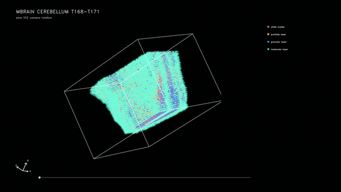
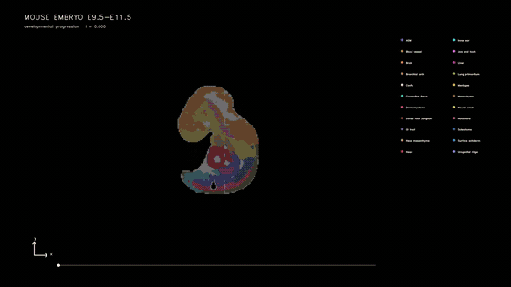
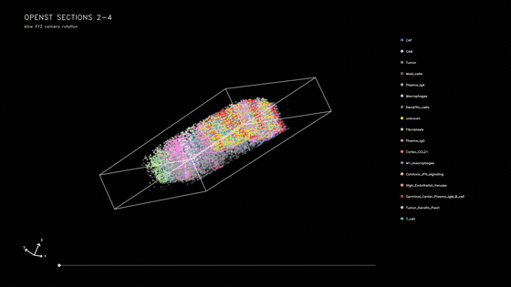

# TissueFlow 2D Tutorial

This tutorial covers the non-lineage 2D workflows for **Mbrain**, **Membryo**, and **OpenST**. Run commands from the repository root:

```bash
conda activate stvirtual-3dslice
export PYTHONPATH="$(pwd)/src:${PYTHONPATH}"
```

## Results

### Mbrain — T168 to T171



### Membryo — E9.5 to E15.5

The GIF concatenates E9.5→E11.5, E11.5→E13.5, and E13.5→E15.5.



### OpenST — three transitions

The GIF concatenates S2→S4, S17→S19, and S24→S26.



## 1. Choose an experiment

```text
experiments/Mbrain/
experiments/Membryo/
experiments/OpenST/
```

Each directory contains `config.yaml`, `preprocess.ipynb`, `decoder.ipynb`, and `train.ipynb`. Mbrain and Membryo use the mouse LR table; OpenST uses the human table. The configured models are `stvirtual.models.stage1_2d` and `stvirtual.models.stage2_2d`.

## 2. Input data

Place or symlink the source data under `experiments/<dataset>/data/`. The preprocessing notebook must produce categorical stage and cell-type annotations, spatial coordinates, a raw `counts` layer, and a registered AnnData suitable for scanVI. The recommended latent key is `obsm["X_scanVI"]`; use `latent_key` in `config.yaml` to select another `obsm` representation.

## 3. Preprocessing

Open `experiments/<dataset>/preprocess.ipynb`. It harmonizes labels and coordinates, trains scanVI without a time input, and saves the model-ready data to:

```text
experiments/<dataset>/artifacts/checkpoints/scanvi/adata.h5ad
```

Mbrain preprocessing also performs alignment and LR computation. Confirm all expected stages are present before training.

## 4. Expression decoder

Open `decoder.ipynb`. It trains route-specific, time-free latent-to-expression decoders and writes checkpoints named by source and target:

```text
artifacts/checkpoints/decoder/checkpoints/<src>_<tgt>.pt
```

Stage 2 decodes the LR genes needed during rollout. Full-gene decoding is a downstream analysis step.

## 5. Train the model

Open `train.ipynb`.

### 5.1 Stage 1

Stage 1 learns the UOT/ODE route and writes route checkpoints under `artifacts/checkpoints/stage1/`. Its interpolated trace is saved under the same experiment rather than the source-data directory.

### 5.2 Boundary construction

The notebook converts the Stage-1 trace into per-frame 2D boundary files under `artifacts/results/bound/<src>_to_<tgt>/`. Do not reuse boundaries after changing coordinates, Stage-1 results, or boundary parameters.

### 5.3 Stage 2 and rollout

Stage 2 learns birth, death, movement, occupancy, LR, and latent dynamics. Policy checkpoints are written to `artifacts/checkpoints/stage2/`; final frames are written to `artifacts/results/rollout/`.

## Output contract

Each rollout route is written to `artifacts/results/rollout/<src>_to_<tgt>/`. Every frame is an AnnData file with coordinates in `obsm["spatial"]`, latent states in `obsm["X_latent"]`, and public annotations in `obs["celltype"]` and `obs["celltype_id"]`. The adjacent `celltype_mapping.csv` maps IDs to names.

## Recommended order

1. Review and edit `config.yaml`.
2. Run `preprocess.ipynb`.
3. Run `decoder.ipynb`.
4. Run `train.ipynb` from top to bottom.
5. Inspect boundary coverage and the first and last rollout frames before downstream analysis.

Input data may be symlinked under `data/`. All generated files must remain under `artifacts/`; the workflow must never write into the linked source-data directory.
