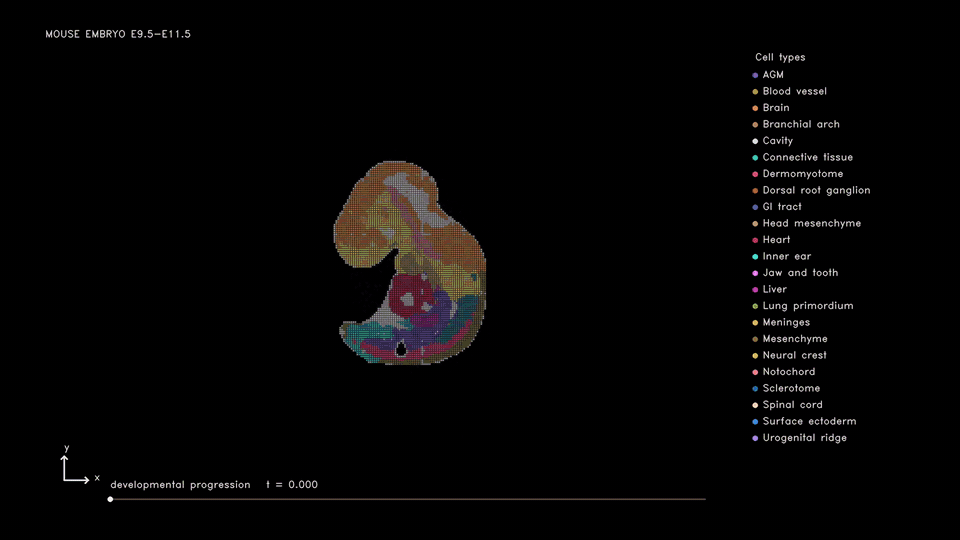
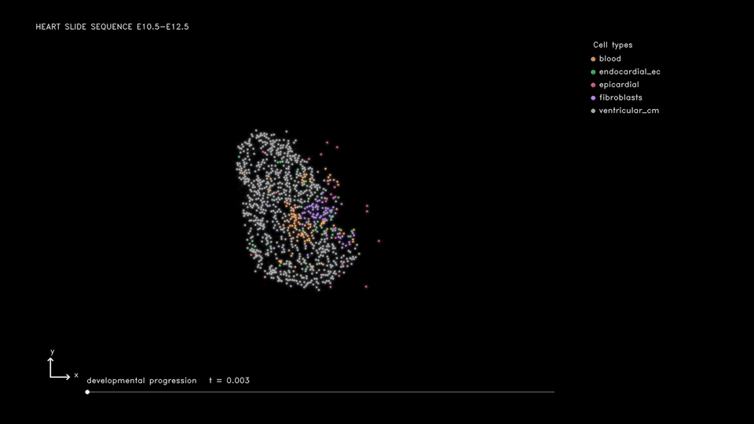

# Developmental reconstruction across time

## 1. Input data

| Dataset | Folder | Required files |
| --- | --- | --- |
| [Membryo](https://db.cngb.org/stomics/mosta/download/) | `experiments/Membryo/data/` | `Mouse_embryo_all_stage.h5ad` (full sections from E9.5 to E16.5) |
| [Mcardiac_EA](https://www.ncbi.nlm.nih.gov/geo/query/acc.cgi?acc=GSE282547) | `experiments/Mcardiac_EA/data/GSE282547/` | `GSM9065770_SlideSeq_e10.5_1.h5ad`, `GSM8645803_SlideSeq_e12_2.h5ad`, `GSM8645808_SlideSeq_e12_wt1dta_1.h5ad` |

Mcardiac_EA: place barcode-matched CSVs with the same stems under `data/coordinates/`. Keep `roi_polygons.json` in `experiments/Mcardiac_EA/`.

Included LR table: `lrpairs/mouse/LR_pairs.csv`.

## 2. Edit config

Paths are relative to each dataset directory. Set input and output paths in the files below.

| Dataset | Config | Edit |
| --- | --- | --- |
| Membryo | [config.yaml](../../experiments/Membryo/config.yaml) | `data_root`, `alignment_reference`, `route_ids` |
| Mcardiac_EA | [config.yaml](../../experiments/Mcardiac_EA/config.yaml) | `raw_data_dir`, `coordinate_dir`, `routes`, `transition_prior_path` |

`transition_prior_path` points to `transition_prior.csv` for Mcardiac_EA, a table of prior cell-state transitions. Each row maps `src_layer` (source cell type or state) to `tgt_layer` (target cell type or state). Label names must match the input annotations.

## 3. Preprocessing

| Dataset | Run | Task |
| --- | --- | --- |
| Membryo | [preprocess.ipynb](../../experiments/Membryo/preprocess.ipynb) | All sections: counts, scanVI, spatial alignment |
| Mcardiac_EA | [preprocess.ipynb](../../experiments/Mcardiac_EA/preprocess.ipynb) | QC, scanVI, spatial alignment |

## 4. Train decoder

| Dataset | Run |
| --- | --- |
| Membryo | [decoder.ipynb](../../experiments/Membryo/decoder.ipynb) |
| Mcardiac_EA | [decoder.ipynb](../../experiments/Mcardiac_EA/decoder.ipynb) |

Train one decoder per selected sample pair using all genes retained in the input.

## 5. Train model

| Dataset | Run |
| --- | --- |
| Membryo | [train.ipynb](../../experiments/Membryo/train.ipynb) |
| Mcardiac_EA | [train.ipynb](../../experiments/Mcardiac_EA/train.ipynb) |

## 6. Results

Paths below are relative to `experiments/<dataset>/`.

| Files | Folder |
| --- | --- |
| Trained models | `artifacts/checkpoints/` |
| Simulation frames | `artifacts/results/simulation/<src>_to_<tgt>/` |
| Overview image | `artifacts/results/overview/<src>_to_<tgt>.png` |

Run the last cell of `train.ipynb` to save the overview image. Open it from `artifacts/results/overview/`. Mcardiac_EA also has [results.ipynb](../../experiments/Mcardiac_EA/results.ipynb) for viewing frames.

## 7. Existing result preview

### Membryo — E9.5 to E11.5, E11.5 to E13.5, E13.5 to E15.5

### Mcardiac_EA — E10.5 CD1 to E12.5 CD1

