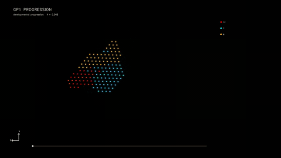
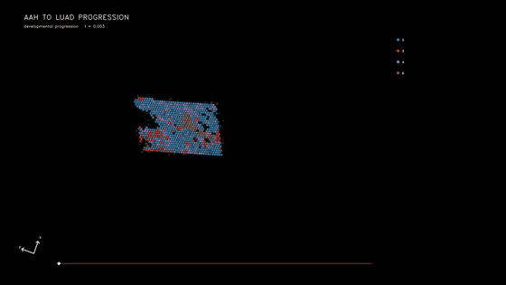

# LineageFlow 2D Tutorial

This tutorial covers the lineage-aware 2D workflows for **GP1** and **LUAD**.

```bash
conda activate stvirtual-3dslice
export PYTHONPATH="$(pwd)/src:${PYTHONPATH}"
```

## Results

### GP1 — normal to cancer



### LUAD — AAH to LUAD



## 1. Input data

Use `experiments/GP1` or `experiments/LUAD`. Both workflows require spatial counts, stage labels, cell annotations, a human LR table, and `data/diff_map.csv`. GP1 uses `annotation`; LUAD uses `_clone_s` as its configured source label.

The differentiation map must contain:

```csv
src_layer,tgt_layer,weight
7,6,1.0
6,1,1.0
```

The lineage model stops with an explicit error when this file is missing. Multi-hop paths are executed sequentially; a committed intermediate cell may later enter another permitted transition.

## 2. Preprocessing

Run `preprocess.ipynb`. GP1 attaches metadata before training scanVI. LUAD additionally aligns AAH coordinates to the LUAD reference using feature-guided rigid UOT and writes `cx_aligned`, `cy_aligned`, and `obsm["spatial_aligned"]`.

The canonical output is:

```text
artifacts/checkpoints/scanvi/adata.h5ad
```

It must contain `layers["counts"]` and `obsm["X_scanVI"]`.

## 3. Expression decoder

Run `decoder.ipynb`. Route-specific checkpoints are stored as:

```text
artifacts/checkpoints/decoder/checkpoints/<src>_<tgt>.pt
```

The decoder accepts latent vectors only; rollout time is metadata and is never a decoder input.

## 4. Train the model

Open `train.ipynb`.

### 4.1 Stage 1

`stvirtual.models.stage1_2d` learns the source-to-target transport. Checkpoints and Stage-1 traces stay under `artifacts/checkpoints/stage1/`.

### 4.2 Boundary files

Per-frame boundaries are generated under `artifacts/results/bound/`. Rebuild them whenever Stage 1, alignment, or boundary settings change.

### 4.3 Lineage-aware Stage 2

`stvirtual.models.stage2_2d_lineage` loads `diff_map.csv`, trains the RL policy, and writes `artifacts/checkpoints/stage2/policy_<src>_to_<tgt>.pt`. Confirm the log contains `[diff] loaded`.

## 5. Lineage output

In addition to the standard contract, frames contain `uid`, `parent_uid`, `diff_alpha`, `src_layer`, and `tgt_layer`. `celltype` is the authoritative committed state. Use `uid` across frames and `parent_uid` for birth ancestry; a single source/target pair is not a complete multi-hop transition history.

## 6. Reproducibility

Keep decoder checkpoint, Stage-2 epochs, boundary seed, rollout seed, and differentiation map fixed when comparing runs. For GP1, 6/9 appear before 1, as required by the configured graph.

## Output contract

Each rollout route is written to `artifacts/results/rollout/<src>_to_<tgt>/`. Every frame is an AnnData file with coordinates in `obsm["spatial"]`, latent states in `obsm["X_latent"]`, and public annotations in `obs["celltype"]` and `obs["celltype_id"]`. The adjacent `celltype_mapping.csv` maps IDs to names.

## Recommended order

1. Review and edit `config.yaml`.
2. Run `preprocess.ipynb`.
3. Run `decoder.ipynb`.
4. Run `train.ipynb` from top to bottom.
5. Inspect boundary coverage and the first and last rollout frames before downstream analysis.

Input data may be symlinked under `data/`. All generated files must remain under `artifacts/`; the workflow must never write into the linked source-data directory.
