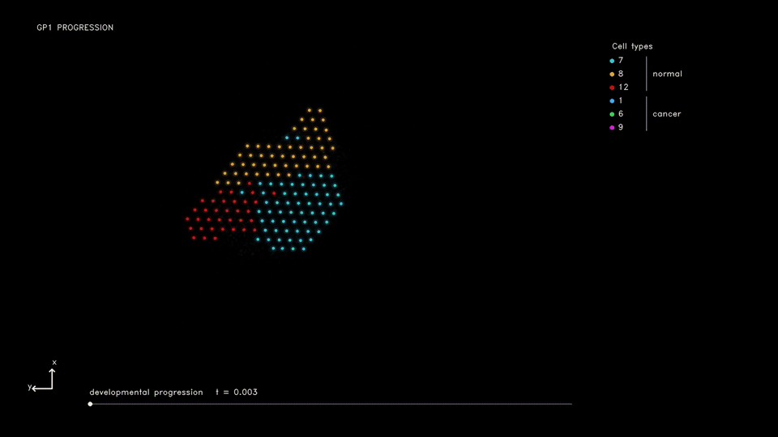
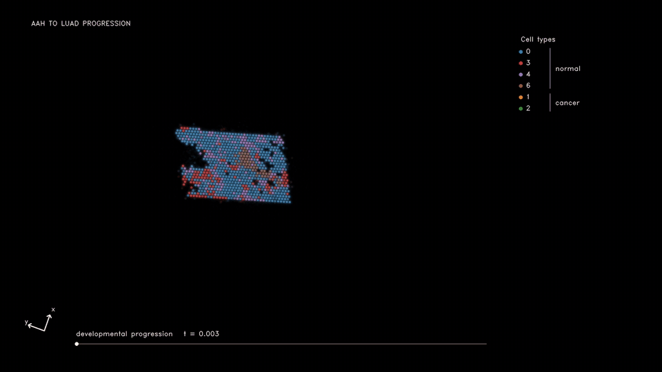

# Cancer progression across stages

## 1. Input data

| Dataset | Folder | Required files |
| --- | --- | --- |
| [Human gastric cancer](https://ngdc.cncb.ac.cn/omix/release/OMIX010346) | `experiments/human_gastric_cancer/data/` | `raw/filtered_feature_bc_matrix.h5`, `raw/spatial/`, `P1_cluster.csv` (`Cell`, `cluster`) |
| [Human lung cancer](https://www.ncbi.nlm.nih.gov/geo/query/acc.cgi?acc=GSE307534) | `experiments/human_lung_cancer/data/` | `source.h5ad` (P2 AAH and P2 LUAD counts, coordinates, `status`, `_clone_s`) |

Included LR table: `lrpairs/human/LR_pairs.csv`.

## 2. Edit config

Paths are relative to each dataset directory. Set input and output paths in the files below.

| Dataset | Config | Edit |
| --- | --- | --- |
| Human gastric cancer | [config.yaml](../../experiments/human_gastric_cancer/config.yaml) | `data_root`, `scanvi_dir`, `transition_prior_path` |
| Human lung cancer | [config.yaml](../../experiments/human_lung_cancer/config.yaml) | `data_root`, `scanvi_dir`, `transition_prior_path` |

`transition_prior_path` points to `data/transition_prior.csv`, a table of prior cell-state transitions. Each row maps `src_layer` (source cell type or state) to `tgt_layer` (target cell type or state). Label names must match the input annotations.

## 3. Preprocessing

| Dataset | Run | Task |
| --- | --- | --- |
| Human gastric cancer | [preprocess.ipynb](../../experiments/human_gastric_cancer/preprocess.ipynb) | Region selection, counts, scanVI, spatial alignment |
| Human lung cancer | [preprocess.ipynb](../../experiments/human_lung_cancer/preprocess.ipynb) | Counts, scanVI, spatial alignment |

## 4. Train decoder

| Dataset | Run |
| --- | --- |
| Human gastric cancer | [decoder.ipynb](../../experiments/human_gastric_cancer/decoder.ipynb) |
| Human lung cancer | [decoder.ipynb](../../experiments/human_lung_cancer/decoder.ipynb) |

Train one decoder per selected sample pair using all genes retained in the input.

## 5. Train model

| Dataset | Run |
| --- | --- |
| Human gastric cancer | [train.ipynb](../../experiments/human_gastric_cancer/train.ipynb) |
| Human lung cancer | [train.ipynb](../../experiments/human_lung_cancer/train.ipynb) |

## 6. Results

Paths below are relative to `experiments/<dataset>/`.

| Files | Folder |
| --- | --- |
| Trained models | `artifacts/checkpoints/` |
| Simulation frames | `artifacts/results/simulation/<src>_to_<tgt>/` |
| Overview image | `artifacts/results/overview/<src>_to_<tgt>.png` |

Run the last cell of `train.ipynb` to save the overview image. Open it from `artifacts/results/overview/`.

## 7. Existing result preview

### Human gastric cancer — normal to cancer

### Human lung cancer — AAH to LUAD

