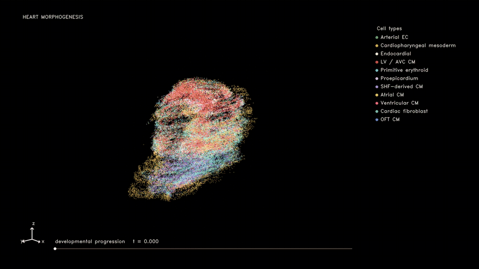

# 4D spatiotemporal development reconstruction

## 1. Input data

| Dataset | Folder | Required files |
| --- | --- | --- |
| [Mcardiac](https://db.cngb.org/stomics/mosta/download/) | `experiments/Mcardiac/data/` | `Mosta_heart_9h.h5ad`, `Mosta_heart_11h_full.h5ad` (counts, cell-type labels, XYZ coordinates) |

Included LR table: `lrpairs/mouse/LR_pairs.csv`.

## 2. Edit config

Paths are relative to each dataset directory. Set input and output paths in the files below.

| Dataset | Config | Edit |
| --- | --- | --- |
| Mcardiac | [config.yaml](../../experiments/Mcardiac/config.yaml) | `data_root`, `scanvi_dir`, `transition_prior_path` |

`transition_prior_path` points to `data/transition_prior.csv`, a table of prior cell-state transitions. Each row maps `src_layer` (source cell type or state) to `tgt_layer` (target cell type or state). Label names must match the input annotations.

<a id="infer-transitions-without-a-supplied-diff-map"></a>

Without a supplied prior: after preprocessing, run this command from the repository root, then set `transition_prior_path: artifacts/transition_uot/discovered_transition.csv`. Use separate checkpoint and result paths.

```bash
python experiments/Mcardiac/infer_transition_map.py
```

## 3. Preprocessing

| Dataset | Run | Task |
| --- | --- | --- |
| Mcardiac | [preprocess.ipynb](../../experiments/Mcardiac/preprocess.ipynb) | Counts, scanVI, XYZ normalization |

## 4. Train decoder

| Dataset | Run |
| --- | --- |
| Mcardiac | [decoder.ipynb](../../experiments/Mcardiac/decoder.ipynb) |

Train one decoder per selected sample pair using all genes retained in the input.

## 5. Train model

| Dataset | Run |
| --- | --- |
| Mcardiac | [train.ipynb](../../experiments/Mcardiac/train.ipynb) |

<a id="output-contract"></a>

## 6. Results

Paths below are relative to `experiments/<dataset>/`.

| Files | Folder |
| --- | --- |
| Trained models | `artifacts/checkpoints/` |
| Simulation frames | `artifacts/results/E9.5h_to_E11.5h_<timestamp>/simulation/` |
| Overview image | `artifacts/results/overview/<src>_to_<tgt>.png` |

Boundaries: `artifacts/results/bound_3d/E9.5h_to_E11.5h/`.

Run the last cell of `train.ipynb` to save the overview image. Open it from `artifacts/results/overview/`.

## 7. Existing result preview

### Mcardiac — E9.5h to E11.5h


