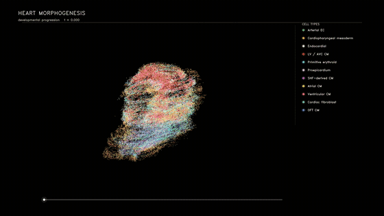

# CardioLineage 3D Tutorial

This tutorial covers **Mcardiac**, the corrected 3D lineage workflow derived from `heart_9_11`.

```bash
conda activate stvirtual-3dslice
export PYTHONPATH="$(pwd)/src:${PYTHONPATH}"
```

## Result



## 1. Input data

Use `experiments/Mcardiac`. The model requires stage labels, cell annotations, raw counts, X/Y/Z coordinates, the mouse LR table, and `data/diff_map.csv`. `config.yaml` fixes `spatial_dimension: 3`, `stage1_3d`, and `stage2_3d_lineage`.

## 2. Preprocessing

Run `preprocess.ipynb` to create consistent 3D coordinates, categorical cell types, and `obsm["X_scanVI"]`. The registered model-ready AnnData is saved to `artifacts/checkpoints/scanvi/adata.h5ad`.

## 3. Expression decoder

Run `decoder.ipynb`. It creates route-specific latent-only decoder checkpoints under `artifacts/checkpoints/decoder/checkpoints/`.

## 4. Train the model

### 4.1 Stage 1

`stvirtual.models.stage1_3d` learns the shared volumetric transport route and writes checkpoints under `artifacts/checkpoints/stage1/`.

### 4.2 Volumetric boundaries

The notebook builds per-frame 3D boundaries under `artifacts/results/bound/`. Rebuild them after any coordinate or Stage-1 change.

### 4.3 Corrected-lineage Stage 2

`stvirtual.models.stage2_3d_lineage` is the sole public Mcardiac baseline. It loads the differentiation map, trains the corrected lineage policy, and saves checkpoints under `artifacts/checkpoints/stage2/`. Historical heart variants must not replace this implementation.

## 5. Lineage output and quality control

Frames record `uid`, `parent_uid`, `diff_alpha`, source and target layers, committed cell type, latent state, and XYZ coordinates. Confirm `[diff] loaded` appears, rotate all axes together, inspect boundary coverage, and validate UID continuity separately from parent-child ancestry.

## Output contract

Each rollout route is written to `artifacts/results/rollout/<src>_to_<tgt>/`. Every frame is an AnnData file with coordinates in `obsm["spatial"]`, latent states in `obsm["X_latent"]`, and public annotations in `obs["celltype"]` and `obs["celltype_id"]`. The adjacent `celltype_mapping.csv` maps IDs to names.

## Recommended order

1. Review and edit `config.yaml`.
2. Run `preprocess.ipynb`.
3. Run `decoder.ipynb`.
4. Run `train.ipynb` from top to bottom.
5. Inspect boundary coverage and the first and last rollout frames before downstream analysis.

Input data may be symlinked under `data/`. All generated files must remain under `artifacts/`; the workflow must never write into the linked source-data directory.
